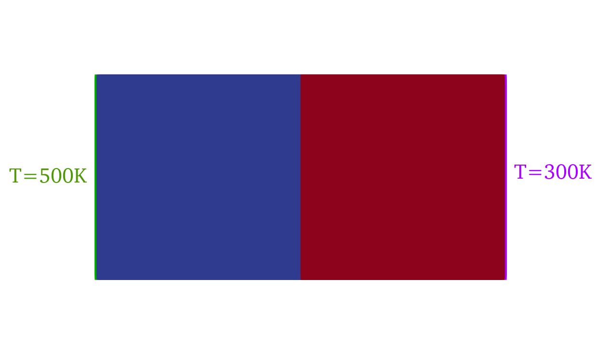
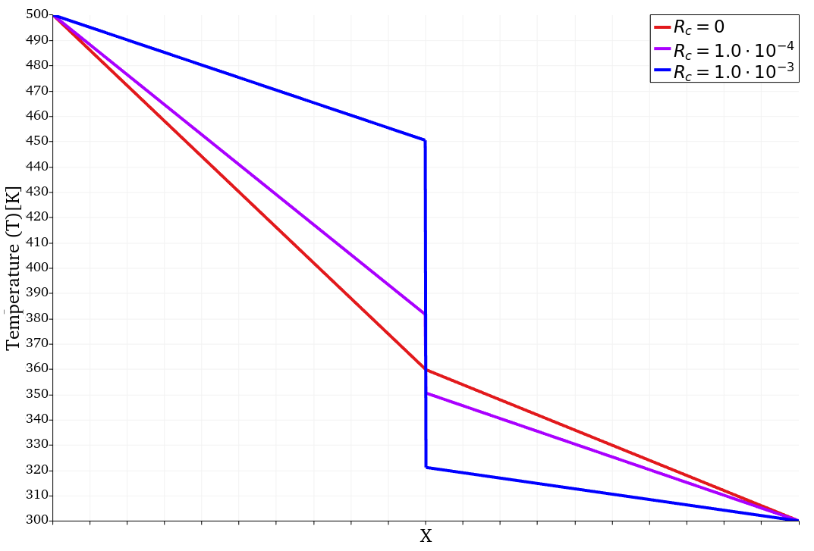
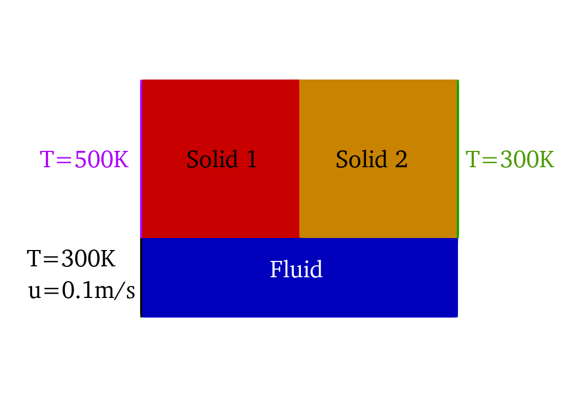
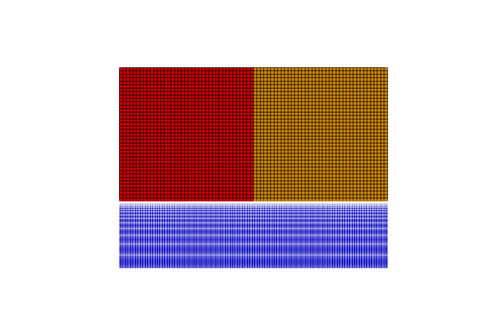
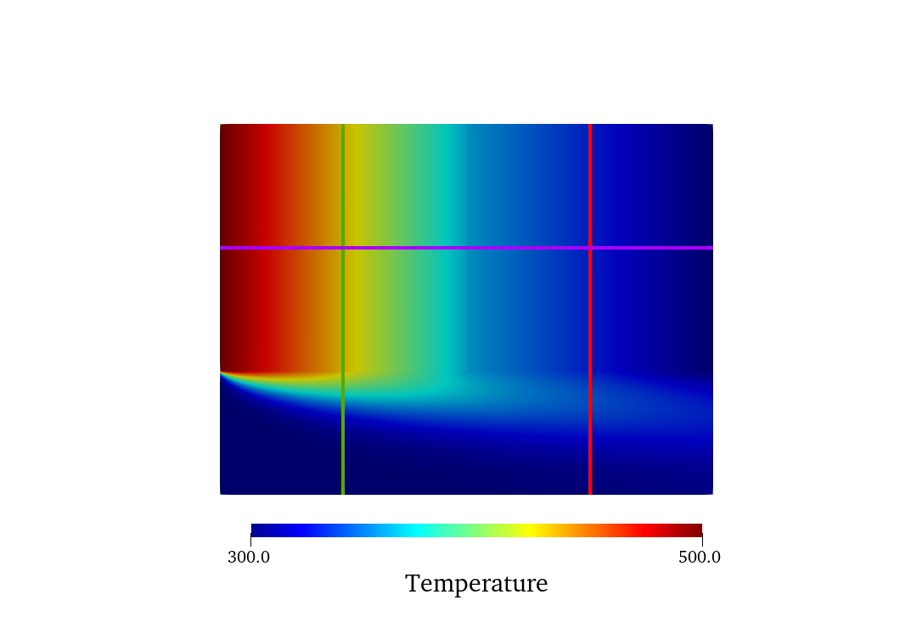
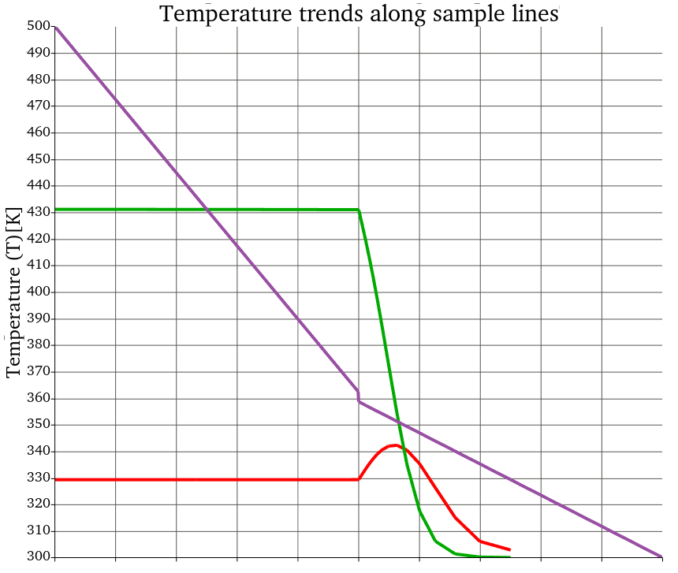
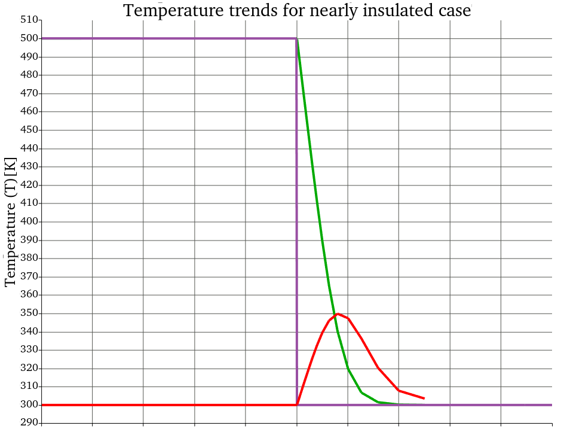

## Goals

This tutorial shows the ability of SU2 to solve conjugate heat transfer problems between solids with contact resistance. Two solids with a different material composition are conducting thermal energy to one another. The thermal energy transfer is limited through the application of contact resistance. In addition, an incompressible flow (air) flows along the two solids, participating in the transfer of thermal energy. 


## Resources

The resources for this tutorial can be found in the [multiphysics/contact_resistance_cht](https://github.com/su2code/Tutorials/tree/master/multiphysics/contact_resistance_cht) directory in the [tutorial repository](https://github.com/su2code/Tutorials). You will need the configuration files for all physical zones ([fluid.cfg](https://github.com/su2code/Tutorials/tree/master/multiphysics/contact_resistance_cht/fluid.cfg), [solid_1.cfg](https://github.com/su2code/Tutorials/tree/master/multiphysics/contact_resistance_cht/solid_1.cfg), [solid_2.cfg](https://github.com/su2code/Tutorials/tree/master/multiphysics/steady_cht/contact_resistance_cht/solid_2)), the cofiguration file to invoke a multiphysics simulation run ([master.cfg](https://github.com/su2code/Tutorials/tree/master/multiphysics/contact_resistance_cht/master.cfg)) and the mesh files. These can be generated through GMesh using the .geo files for the [fluid zone](https://github.com/su2code/Tutorials/tree/master/multiphysics/contact_resistance_cht/fluid_3.geo), and solid zones ([solid 1](https://github.com/su2code/Tutorials/tree/master/multiphysics/contact_resistance_cht/solid_1.geo), [solid 2](https://github.com/su2code/Tutorials/tree/master/multiphysics/contact_resistance_cht/solid_2.geo)).


## Tutorial

The following tutorial will walk you through the steps required when solving for a coupled CHT solution incorporating multiple physical zones and contact resistance. It is assumed you have already obtained and compiled the SU2_CFD code for a serial computation. If you have yet to complete these requirements, please see the [Download](/docs_v8/Download/) and [Installation](/docs_v8/Installation/) pages.

### Background

Typical engineering applications involving conjugate heat transfer often do not concern a single solid material. For example, a pipe transporting a fluid may be composed of different layers of materials or a heat exchanger in a fluid flow has to be attached to the surrounding structure using insulation material. Depending on the application, the estimation of heat transfer through touching solid mediums can be crucial. Unlike the transfer between solid and fluid mediums, the contact between solid mediums is imperfect. Small cavities between the neighboring solids may result in a significant resistance in heat transfer compared to the idealized situation of perfect contact. SU2 allows the user to model the contact resistance between solid domains. 

The heat flux between a conjugate heat transfer interface and the neighboring cell for an idealized contact (no contact resistance) is defined as

$$
q_{w} = \frac{T - T_w}{\frac{l}{k}}
$$

where $T$ is the temperature in the neighboring cell, $T_w$ the wall temperature, $l$ the distance between the cell center and the interface, and $k$ the thermal conductivity of the solid medium. The effect of contact resistance is modeled similarly compared to the contact resistance of [Ansys Fluent](https://www.afs.enea.it/project/neptunius/docs/fluent/html/th/node358.htm). 

$$
q_{w} = \frac{T - T_w}{\frac{l}{k} + R_c}
$$

Here, $R_c$ is the contact resistance with the units $m K W^{-1}$, or the inverse of the heat transfer coefficient. For ideal contact, $R_c$ is equal to zero. This results in the temperature on both sides of the interface to be equal. Applying a non-zero value for $R_c$ restricts the heat transfer between the two solid domains, resulting in a temperature discontinuity. To illustrate this, consider the following set-up with two solid domains.


Figure 1: Two solid domains subject to iso-thermal boundary conditions connected by a zone interface.


Here, the two colored blocks have different thermal properties and are subject to two isothermal walls. The temperature profile along the centerline for various values of $R_c$ is shown below. The discontinuity between the temperatures on either side of the interface is proportional to the value of $R_c$. 


Figure 2: The effect of altering the contact resistance at the interface between the solid domains. 

What follows is a tutorial with heat transfer between solid and fluid domains that illustrates the use of the contact resistance model. 

### Problem Setup

This problem will solve for the incompressible flow along side two solid, metal blocks with different thermal properties, subject to heat transfer with contact resistance at the interface between the blocks. The simulation setup is shown below. The two solid blocks are squares with a side length of 1.0e-02m, while the fluid domain has a width of 5.0e-03m.


Figure 3: Computational setup for the tutorial problem for conjugate heat transfer between solid and fluid domains.

The following flow conditions that are set for the fluid domain with a Reynolds number of 260:
- Fluid model: incompressible, ideal gas
- Density  = 1.29 kg/m^3
- Inlet Velocity Magnitude = 0.1 m/s
- Inlet temperature = 300 K
- Viscosity (constant) = 1.0e-05 kg/(m-s)

Solid domain 1 has the material properties of stainless steel:
- Density = 8935 kg/m^3
- Specific heat = 3850 J/(kg-K)
- Thermal conductivity = 26 W/(m-K)

Solid domain 2 has the material properties of copper: 
- Density = 8000 kg/m^3
- Specific heat = 4420 J/(kg-K)
- Thermal conductivity = 61 W/(m-K)

The two solid blocks each are subject to an iso-thermal wall boundary condition, which drives the transfer of heat between the solid domains and the fluid. The interface type for all domains was set to ```DIRECT_TEMPERATURE_ROBIN_HEATFLUX```, with a contact resistance value of 1.0e-04 K-m/W applied to the interface between Solid 1 and Solid 2. All other boundaries were defined as symmetry boundary conditions.


### Mesh Description

The computational mesh for all domains consist of quads and can be generated through Gmesh. The .geo files for [Solid 1](https://github.com/su2code/Tutorials/tree/master/multiphysics/contact_resistance_cht/solid_1.geo) and [Solid 2](https://github.com/su2code/Tutorials/tree/master/multiphysics/contact_resistance_cht/solid_2.geo) describe a simple, square mesh with 40 nodes along each side. The .geo file for the [fluid domain](https://github.com/su2code/Tutorials/tree/master/multiphysics/contact_resistance_cht/fluid_3.geo) contains refinement commands around the solid-fluid interfaces.


Figure 4: The computational mesh with all three physical zones.

### Configuration File Options

Several of the key configuration file options for this simulation are highlighted here. For this problem, four configuration files are used. The [master configuration file](https://github.com/su2code/Tutorials/tree/master/multiphysics/contact_resistance_cht/master.cfg) describes the interface between the fluid and solid domains as well as the application of contact resistance. 
```
CONFIG_LIST = (solid_1.cfg, solid_2.cfg, fluid.cfg)
MARKER_ZONE_INTERFACE= (cht_interface_1_2, cht_interface_2_1,\
                        cht_interface_1_3, cht_interface_3_1,\
                        cht_interface_2_3, cht_interface_3_2)

MARKER_CHT_INTERFACE= (cht_interface_1_2, cht_interface_2_1,\
                        cht_interface_1_3, cht_interface_3_1,\
                        cht_interface_2_3, cht_interface_3_2)

```
Here, ```cht_interface_1_2``` and ```cht_interface_2_1``` are the boundaries connecting Solid 1 with Solid 2, while the other interfaces connect the fluid and solid domains. The contact resistance model in SU2 allows the user to apply a contact resistance value for each of the interfaces. 

```
CHT_INTERFACE_CONTACT_RESISTANCE = (1e-4,0,0)
```

Be mindful that the number of values for contact resistance should match the number of interfaces. For solid-fluid interfaces, the contact resistance model does not apply. Applying a non-zero value for contact resistance for such interfaces will therefore not affect the simulation results.

The configurations for the [steel solid domain](https://github.com/su2code/Tutorials/tree/master/multiphysics/contact_resistance_cht/solid_1.cfg), [copper solid domain](https://github.com/su2code/Tutorials/tree/master/multiphysics/contact_resistance_cht/solid_2.cfg), and [fluid domain](https://github.com/su2code/Tutorials/tree/master/multiphysics/contact_resistance_cht/fluid_3.cfg) all contain standard settings for multi-physics simulations. 


### Running SU2

In order to run this test case, follow these steps at a terminal command line:
 1. Move to the directory containing the config files and the mesh files. Make sure that the SU2 tools were compiled, installed, and that their install location was added to your path.
 2. Run the executable by entering 
 
    ```
    $ SU2_CFD master.cfg
    ```
 
    at the command line. 
 3. SU2 will print residual updates with each outer iteration of the flow solver, and the simulation will terminate after reaching running for 2000 iterations
 4. Files containing the results will be written upon exiting SU2. The solutions for both solid and fluid domains are contained in a single ParaView multiblock file (.vtm), from which the solutions can be loaded.

### Results 

The temperature solution of the completed simulation is shown below. The hot, stainless steel block heats up the flow in the fluid domain, which transfers the heat partially to the copper block downstream through convection. 


Figure 5: Temperature solution for the current setup.

The effect of the application of contact resistance becomes clear when visualizing the temperature trend across interfaces. Three temperature trends according to each interface are shown below and are color coded corresponding to the lines shown in Figure 6.


Figure 6: Temperature trends across the heat transfer interfaces.

The temperature trends across the solid-fluid interfaces (green, red) are continuous, the temperature trend across the solid-solid interface (purple) shows a discontinuity at the interface as a result of the application of contact resistance. This effect can be exaggerated when increasing the value for the contact resistance. For example, when applying a contact resistance value of 10 W-m/K,
```
CHT_INTERFACE_CONTACT_RESISTANCE = (10.0,0,0)
```
 the two solid domains are currently essentially insulated from one another. This results in the following temperature solution.


Figure 7: Temperature solution for a contact resistance value of 10.0 W-m/K.



Figure 8: Temperature trends across the interfaces for a contact resistance value of 10.0 W-m/K.
